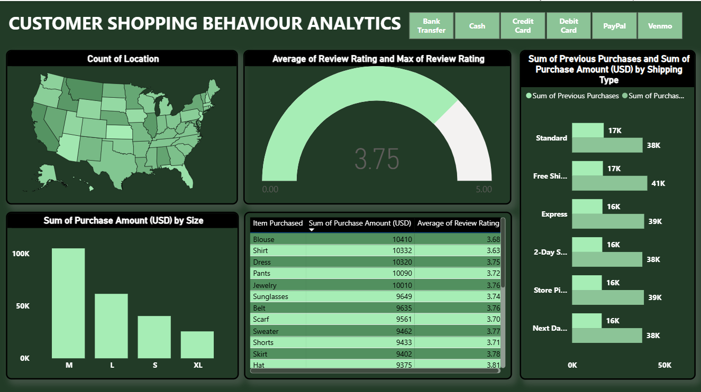

# Customer Shopping Analytics Dashboard

## Overview

This project is an interactive Power BI dashboard developed to analyze customer shopping behavior and purchasing trends using a retail dataset from 2023. The dashboard provides insights into customer preferences, payment methods, product performance, review ratings, shipping choices, and geographic distribution of purchases.

The goal of this dashboard is to help businesses understand customer behavior and make data-driven decisions to improve sales performance and customer satisfaction.

---

## Dashboard Preview

---

## Key Features

- Interactive payment method filtering
- Geographic visualization of customer distribution across the United States
- Purchase amount analysis by product size
- Product-wise sales performance tracking
- Customer review rating analysis
- Shipping method comparison
- Dynamic cross-filtering between visuals
- KPI monitoring through gauge charts

---

## Dataset Information

The dataset contains customer shopping records and includes attributes such as:

- Customer Location
- Item Purchased
- Purchase Amount (USD)
- Product Size
- Review Rating
- Payment Method
- Shipping Type
- Previous Purchases

---

## Dashboard Components

### Location Analysis
Visualizes customer distribution across different states using a map chart.

### Customer Satisfaction
Displays average customer review ratings through a KPI gauge.

### Shipping Analysis
Compares purchase amounts and previous purchases across shipping methods.

### Product Performance
Shows total purchase amounts for different product categories.

### Purchase Size Analysis
Analyzes customer spending patterns across product sizes.

### Interactive Filtering
Allows users to filter dashboard insights using various payment methods including:
- Bank Transfer
- Cash
- Credit Card
- Debit Card
- PayPal
- Venmo

---

## Key Insights

- Medium-sized products generated the highest overall purchase amount.
- Customer review ratings remained relatively stable with an average rating of approximately 3.8/5.
- Standard Shipping and Free Shipping accounted for a significant share of purchases.
- Shoes, Blouses, and T-Shirts emerged as top-performing product categories.
- Customer purchasing behavior varied across payment methods and shipping preferences.

---

## Tools & Technologies

- Power BI
- Power Query
- DAX (Data Analysis Expressions)
- Data Visualization
- Business Intelligence Reporting

---

## Skills Demonstrated

- Data Cleaning and Transformation
- Data Modeling
- Dashboard Design
- KPI Visualization
- Business Analytics
- Interactive Reporting
- Data Storytelling

---

## How to Use

1. Download the `.pbix` file.
2. Open it using Microsoft Power BI Desktop.
3. Explore the dashboard using interactive filters and visualizations.

---

## Future Improvements

- Advanced customer segmentation analysis
- Predictive sales forecasting
- Customer lifetime value analysis
- Profitability dashboards
- Additional KPI tracking

---

## Author

Devesh Chauhan

Computer Science Engineering Student | Aspiring Data Scientist
